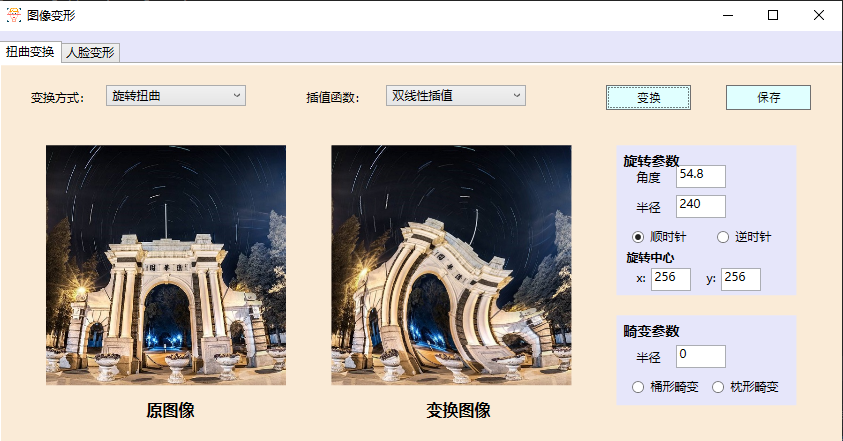
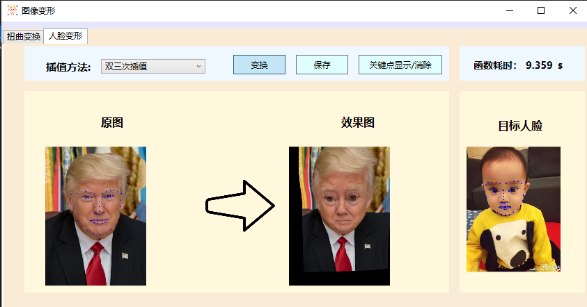

# 图像变形程序

> 作者：高子靖
>
> 学号：2017010917
>
> 班级：自72
>
> Email: gaozj17@mails.tsinghua.edu.cn
-------

## 项目简介

本项目为基于C#的图像变形小程序，能够实现图像的扭曲变换，畸变校正，以及在给出关键点的图像对进行人脸变形。插值方法通过：最近邻插值，双线性插值和双三次插值三种函数分别实现。

## 运行环境
- Windows 10 x64
- C# .NET Framework 4.6.1框架
- 使用WPF应用进行UI设计

## 库
- System.Drawing(Bitmap类作为图像读写接口)
- System.IO(实现文件读写)
- System.Windows.Media.Imaging
- Microsoft.Win32

## 目录结构

- Numercial_Source/：源代码
- bin/：可执行文件所在目录
- report.pdf：报告文档
- mdimage:编译README.markdown所需要的图片
- input_image:包括image为测试输入图片和My_txt为关键点左边文件
- result_image:为输出结果图片

## 操作说明

### 运行程序
- 双击`bin/Realease/`文件夹下的`Numercial_image1.exe`，便可以运行程序，获得如下所示的初始界面：

  
### 扭曲变换

#### 参数说明
- 变换方式可以选择`畸变矫正`或`旋转扭曲`
- 插值函数下拉可选择`最邻近插值`，`双线性插值` ，`双三次插值`
- 旋转参数部分可输入参数`角度`，`半径`，`旋转方向`和`旋转中心`，必须为数字输入，否则会进行提示。
- 旋转中心在图片载入后会自动初始化为图片正中心
- `变换`按钮进行变换，前提参数选取完成
- 保存图片可通过`保存`按钮或单击转换后的图片

#### 扭曲变换
- 点击CLICK区域上传图片，选择变换方式为扭曲变换，选择插值函数，选择好参数后点击变换

    
- 点击**保存**，或者**点击图片**，可以将图片保存至本地

  

#### 畸变校正
- 选取变换方式为**畸变校正**，选择桶形畸变，选择插值函数为**双三次插值**，设置半径，点击变换
    

### 人脸变形
- 点击分页设置的**人脸变形**，进入到人脸变形界面
    

#### 参数说明

- 插值方法，可选`最近邻`，`双线性`，`双三次`
- 点击两个CLICK图标进行图片的上传
- 变换按钮直接进行人脸变换，变换完成后右上角的函数耗时会显示刚刚的运行时间
- **关键点显示/消除**可以在原图和目标人脸的图像中使用蓝色点标出人脸关键点，或消除
- 效果图保存操作同上

#### 变形操作
- 点击CLICK上载图片，并选择插值方法为`双三次插值`，点击显示关键点，后点击**保存**
    

